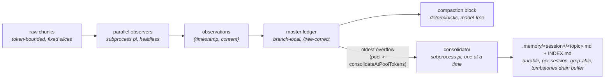

# observational-memory

Tiered, subprocess-backed memory for pi.

Parallel **observers** distill raw conversation chunks into atomic observations committed to the master's branch-local **ledger** (so memory stays correct under `/tree`); a deterministic, model-free **compaction** renders that buffer verbatim into the compaction block. A **consolidator** promotes the oldest observations into durable `.memory/<sessionId>/` topic files, bounding the buffer and giving each session its own durable, `grep`-able long-term memory (a fork seeds its memory from its parent).

## On/off gate (default OFF)

The extension ships in the global extensions folder during development, so it is **gated off
per session** and is completely invisible until you turn it on.

- `/om` — toggle for this session
- `/om on` / `/om off` — set explicitly

State persists per session in the ledger (`om.enabled`) and survives resume. When off, every
trigger, hook, widget, and subprocess returns immediately.

## How it works



Pipeline: raw chunks → observers → observations → ledger → compaction block, with a
consolidator draining the oldest observations into durable per-session memory files.

- **Observer clock** (`turn_end` / `agent_start`): every `chunkTokens` of new raw history,
  cut a fixed-token slice and fire an observer subprocess. Observers are embarrassingly
  parallel pure mappers (capped by `observerConcurrency`); each commits its own
  `coversUpToId` watermark, so out-of-order completion is fine.
- **Observation** = `{ timestamp, content, tokenCount }`. The precise event-`timestamp`
  doubles as the id; the orchestrator re-derives a unique, second-resolution id at commit
  (the observer only emits minute resolution).
- **Compaction** (`agent_end` over `compactAtContextTokens`, when idle): waits for in-flight
  observers, then renders the active buffer plus a **memory map** (rendered live from
  `.memory/<session>/` topic front-matter) and a **journey** section (`.memory/<session>/JOURNEY.md`, read
  verbatim). The cutoff snaps to an observation chunk boundary so the verbatim tail is never
  double-represented.
- **Consolidator clock** (`turn_end` / `agent_start`): when the active observation pool
  exceeds `consolidateAtPoolTokens`, a single background consolidator subprocess folds the
  **oldest** observations (above `poolTargetTokens`) into durable `.memory/<session>/<topic>.md`
  files, then the orchestrator tombstones exactly the observations it reports — draining the
  buffer back toward target. Topic files are **scoped per session** (`.memory/<sessionId>/`,
  keyed by the immutable session-header id, so two sessions in the same project never share
  output) and track the session, not the branch: they are **not** rolled back by `/tree`. On a
  fork/clone the new session's memory is **seeded once** from the parent (matching the ledger,
  which already travels with the fork). The orchestrator owns `INDEX.md` and re-renders it from
  topic front-matter after each run; the consolidator touches `<topic>.md` files plus
  `JOURNEY.md`, via its own `read`/`write`/`edit`/`ls`/`grep` tools scoped to the session dir.
- **Journey** (`.memory/<session>/JOURNEY.md`): a single, whole-project, purely **descriptive** prose
  history of how the work got to its current state, maintained by the consolidator and pushed
  into every compaction block for **orientation** (not recall, not instructions). It is
  append-mostly: each consolidation adds a short dated segment and compresses the oldest
  segments only once the file exceeds `journeyTargetTokens`, so recent history stays detailed
  and the section stays bounded. Like the topic files it does **not** roll back under `/tree`.

Each worker is an **ordinary recorded pi session** in the global store
(`~/.pi/agent/sessions`, under the project path) — open it in the session browser to see the
exact input chunk, tool calls, and output. Transient handoff files live in
`<project>/.memory/<sessionId>/.runs/`.

### Cost tracking

Every worker is a `pi` subprocess, so its spend is captured from pi's **built-in**
`usage.cost.total` (reliable, already computed). The worker extension — *not* the model —
accumulates that figure and hands it back via the run's cost file
(`.memory/<session>/.runs/<runId>.cost.json`), alongside the existing observation IPC. The orchestrator
folds each run into an `om.cost` ledger entry.

- **Ephemeral-safe:** cost rides the result-file IPC, never a saved session log, so it works
  even if a worker session is not persisted.
- **Never rolls back:** the running total sums *all* `om.cost` entries across the whole
  session (every branch), so real money spent does not decrease under `/tree` — the same
  tier rule as the `.memory/` files.
- **Surfaced** in the footer (`$0.000`, right of the gauges) and in `/om:status`
  (`session cost: $X (N runs)`). Survives resume.

## Commands

| Command | Effect |
|---|---|
| `/om`, `/om on`, `/om off` | The per-session on/off gate |
| `/om:status` | Workers in flight, active observation count, next-observer progress, pool/consolidator state, topic-file count, journey size, context usage, **session cost**, last error |
| `/om:compact` | Force a compaction now (ignores the threshold) |
| `/om:consolidate` | Force a consolidation now (ignores the pool threshold) |
| `/om-parallel` | `serialWorkers=false` — observers run concurrently (cloud models). Saved to global settings **and** applied to the running session immediately |
| `/om-sequential` | `serialWorkers=true` — one worker at a time, observers queue behind the running worker (local models). Saved + applied immediately |
| `/om-change-model` | Interactive picker (role → provider → model → thinking) writing `observational-memory.models.{observer,consolidator}`; confirm step, then saved + applied immediately. Works even when `/om` is off |

## Configuration

Namespace `observational-memory` in `~/.pi/agent/settings.json` (global) or
`.pi/settings.json` (project; overrides global):

> **Precedence:** `/om-parallel`, `/om-sequential` and `/om-change-model` write the **global**
> `~/.pi/agent/settings.json` (atomic write, `<file>.bak` backup) and patch the running session
> in memory. On the next config load a project-level `.pi/settings.json` value still overrides
> the global file — keep project overrides in sync if you use them.

```jsonc
{
  "observational-memory": {
    "chunkTokens": 5000,
    "chunkOverlapTokens": 0,
    "poolTargetTokens": 10000,           // buffer drains back toward this after consolidation
    "consolidateAtPoolTokens": 20000,    // pool size that triggers a consolidation (200% of target)
    "compactAtContextTokens": 100000,    // tune per model
    "tailTokens": 20000,                 // verbatim tail; snaps to a chunk boundary
    "journeyTargetTokens": 1000,         // pushed JOURNEY.md size; compress oldest segments past this
    "observerConcurrency": 4,
    "serialWorkers": false,              // true = queue workers one at a time (local models)
    "models": {
      "observer":     { "provider": "anthropic", "id": "claude-sonnet-4-6", "thinking": "low" },
      "consolidator": { "provider": "anthropic", "id": "claude-sonnet-4-6", "thinking": "medium" }
    },
    "passive": false,
    "debugLog": false
  }
}
```

`PI_OM_PASSIVE=1` forces `passive` (disables all triggers) for clean `/tree` testing.
`passive` is a power-user setting distinct from the on/off gate.

**Local models:** set `"serialWorkers": true` to run at most ONE worker subprocess at any
moment — observers never run in parallel and never overlap the consolidator; the queue
drains itself as workers finish, and when the observation pool is due for consolidation the
consolidator gets the slot before new observers.

## Development

```bash
npm install
npm test          # vitest
npm run typecheck # tsc --noEmit
```

Layout: `src/` is the master-side orchestrator (entry `src/index.ts`); `agent/` is the shared
worker extension loaded into subprocesses via `-e` (`OM_WORKER=observer|consolidator`).
Long-term memory lives under `<project>/.memory/<sessionId>/` (`INDEX.md` + `<topic>.md` +
`JOURNEY.md`), keyed by the immutable session-header id so sessions in the same project stay
isolated; a fork seeds its dir from the parent's on first touch. Transient worker IPC lives
under `<project>/.memory/<sessionId>/.runs/`.